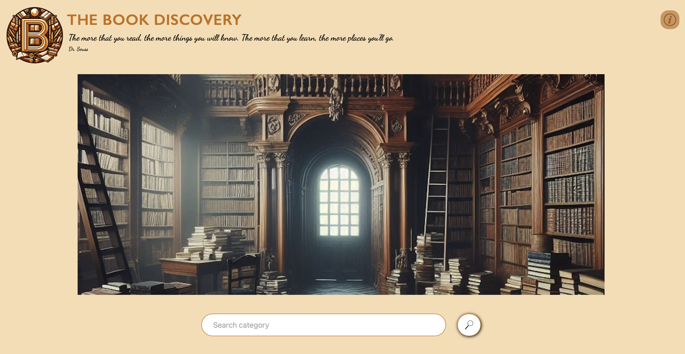
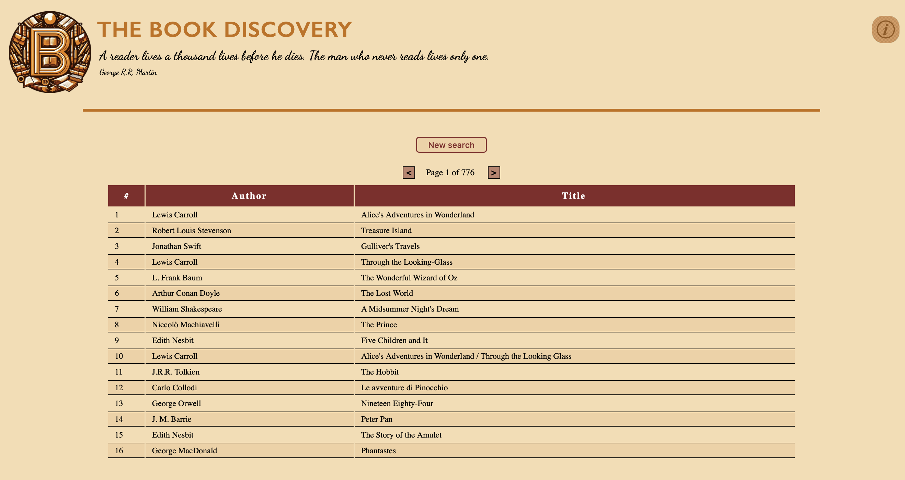
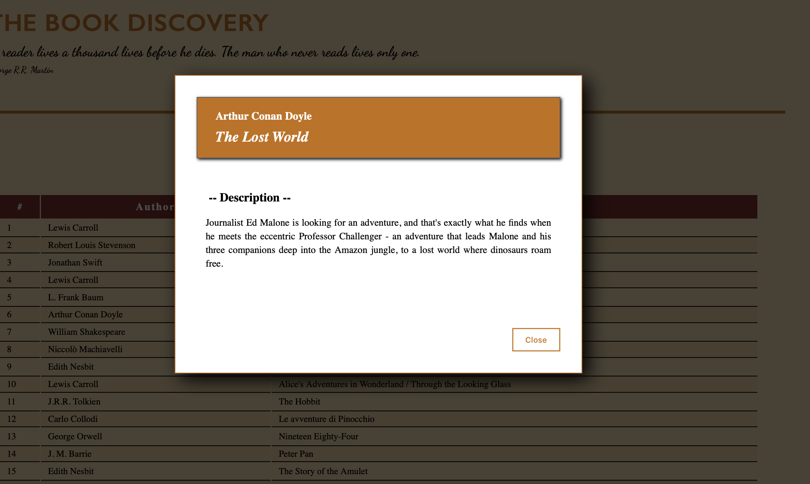

--- THE BOOK DISCOVERY ---

- STRUCTURE 

This is a web application entirely developed using HTML, CSS and JS and with the support of Webpack.

The folder /src is the main folder of the project where we can find the file index.html, the main and unique page where the appllication runs 
and three other sub-folders:

    - /css for css files
      The /css folder contains more than a unique file because readability reasons, so we find a couple of files (index.css and index-other-sizes.css) 
      which are responsible for the styling of the first visualization of the app when we enter it. 
      It is provided a responsive design for the optimization of visualization on various equipments.
      Another couple of files(result-table.css and result-table-other-sizes.css) are responsible for the styling of the results-table visualization 
      and the last couple of files (modal-window.css and modal-window-other-sizes.css) are responsible for the styling of the visulization of errors 
      messages and decriptions of a selected book. 

    - /images for all images used in the project
      Some images have been optimized and have converted from .png or .jpeg to the more convenient .webp format

    - /js for all modules .js used in the project. 
      In this folder ther is the file index.js which is the entry point specified in the webpack configuration file (webpack.config.js)
      The other files have been logically separated depending on their function.

- INTERACTIONS WITH THE STARTING PAGE 

When an user lands on the main page of the webapp the only points of interaction are:

    - The 'info button' situated on the upper right corner. If the user pass over it with the mouse pointer a small window appears with a transition 
      effect. Here the user can read about the name of the developer of the webapp and he also have the minimal information to make the app work.

    - The 'input box' where the user can insert a category of books he wants to search, e.g. Fantasy, Love, Crime, Adventure etc.
      The search proces will start after the pressing of the search button close to the input box.
      The search button is not available for mobile visualization. In this case the user must use the Enter button to start the search.

- RESULTS 

After the searching process the app provides to arrange the visualization of a table 16 rows x 3 columns. So the structure of the table is 16 results 
per page and the three columns represent the progressive number of the results, the author of the book and the title of the book. 

The results are loaded in chunks of 160 books into an array.
In the upper part of the table the user has new interaction points, a button to return back to the main page where to start another search and 
the visulization of the total number of pages relative to the actual search with two buttons to move through the pages of the search.
Every ten pages (remember that a chunk is composed of 160 works) the app launch an additional search in order to load the next chunk of 160 works. 
These last will be loaded again into the array where we already have loaded the previous chunk.
The result table is part itself of the main page, when the table is ready to be displayed the main image of the starting page collapses into a line 
in order to give space to the table that has to be shown. 

- INTERACTIONS WITH THE RESULT TABLE -

Once the user can read the results in the result table he can click on a row, the column is indifferent, and so the app starts a search for the 
description of the book selected. At this stage a modal window will appear with the box in which lays the result of the search.

